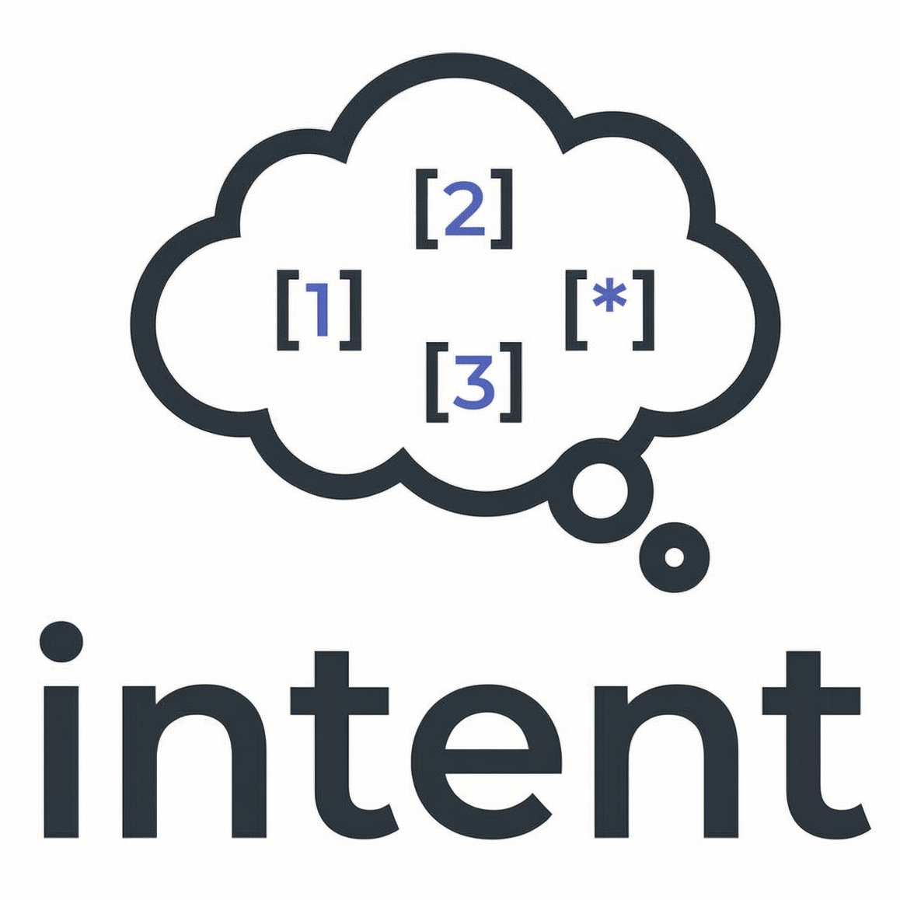

<p align="center">
  
</p>

<h2 align="center">An LLM-based Reranker Library That Explains Itself</h2>

<p align="center">
  <a href="https://www.npmjs.com/package/@with-logic/intent"></a>
  <a href="https://www.npmjs.com/package/@with-logic/intent"></a>
  <a href="https://opensource.org/licenses/MIT"></a>
  <a href="https://nodejs.org"></a>
  <a href="https://www.typescriptlang.org/"></a>
</p>

## Overview

`intent` is an LLM-based reranker library that offers ranking, filtering, and choice all with explicit, inspectable reasoning.

Unlike black-box models, `intent` generates an explanation alongside every score. This transparency allows for easier debugging and enables you to surface reasoning directly to users.

By being LLM powered, it also offers flexibility and dynamic tunability to
your ranking logic without needing to come up with custom embedding models or
retrain existing ones.

## Install

```bash
npm install @with-logic/intent
```

## Quickstart

```ts
import { Intent } from "@with-logic/intent";

const intent = new Intent({ relevancyThreshold: 1 });

const docs = [
  "Many network requests can fail intermittently due to transient issues.",
  "To reduce flaky tests, add exponential backoff with jitter to HTTP retries.",
  "Citrus fruits like oranges and lemons are high in vitamin C.",
];

const ranked = await intent.rank("exponential backoff retries", docs);
// => [
//   "To reduce flaky tests, add exponential backoff with jitter to HTTP retries.",
//   "Many network requests can fail intermittently due to transient issues."
// ]
```

### With explanations

Pass `{ explain: true }` to see why each item was ranked:

```ts
const results = await intent.rank("exponential backoff retries", docs, { explain: true });

for (const { item, explanation } of results) {
  console.log(`- "${item.slice(0, 50)}..."`);
  console.log(`  ${explanation}`);
}
```

```
- "To reduce flaky tests, add exponential backoff wit..."
  This entry explains adding exponential backoff with jitter to HTTP
  retries, directly addressing the requested technique.

- "Many network requests can fail intermittently due ..."
  The summary mentions transient failures in network requests, which can
  motivate using backoff retries but does not describe the method.
```

Intent will use a default Groq client when `GROQ_API_KEY` is set.

## Core API

- `rank(query, candidates)` → rerank + threshold filter (score-based)
- `filter(query, candidates)` → keep only relevant items (boolean)
- `choice(query, candidates)` → choose exactly one best item

All three support `{ explain: true }` to return explanations.

## Example Use Cases

### 1) Ordering search results with `rank()`

Use `rank()` when you want ranked, ordered results.

```ts
import { Intent } from "@with-logic/intent";

type Doc = {
  id: string;
  title: string;
  body: string;
  tags: string[];
};

const intent = new Intent<Doc>({
  key: (d) => d.id,
  relevancyThreshold: 5,
});

const docs: Doc[] = [
  { id: "1", title: "Q2 expenses", body: "Travel, meals, ...", tags: ["finance"] },
  { id: "2", title: "OKR planning", body: "Goals for ...", tags: ["strategy"] },
  { id: "3", title: "Laptop purchases", body: "New laptops ...", tags: ["finance", "it"] },
];

const results = await intent.rank("Find expense reports and anything about spend approvals", docs);
```

### With explanations

```ts
const results = await intent.rank("expense reports", docs, { explain: true });
// => [{ item: Doc, explanation: "Covers Q2 travel and meal expenses..." }, ...]
```

## 2) Tool filtering with `filter()`

Use `filter()` when you want to keep the subset of items in a collection that
are relevant to a query.

```ts
import { Intent } from "@with-logic/intent";

type Tool = {
  name: string;
  description: string;
};

const intent = new Intent<Tool>({
  key: (t) => t.name,
  summary: (t) => t.description,
});

const tools: Tool[] = [
  { name: "search", description: "Search the web for up-to-date information" },
  { name: "sendEmail", description: "Send an email to a recipient" },
  { name: "runSQL", description: "Run a SQL query against the analytics DB" },
  { name: "createInvoice", description: "Create an invoice for a customer" },
];

const task = "Find the customer's last invoice total and email it to them.";

const relevantTools = await intent.filter(task, tools);
// => [sendEmail, runSQL]
```

### With explanations

```ts
const results = await intent.filter(task, tools, { explain: true });

for (const { item, explanation } of results) {
  console.log(`- ${item.name}: ${explanation}`);
}
```

```
- sendEmail: Sending an email is necessary to deliver the invoice total to the customer.
- runSQL: Running a SQL query against the analytics DB can retrieve the last invoice
          total needed for the task.
```

## 3) Model routing with `choice()`

Use `choice()` when you need exactly one selection from a set of items.

```ts
import { Intent } from "@with-logic/intent";

type Model = {
  id: string;
  strengths: string;
};

const intent = new Intent<Model>({
  key: (m) => m.id,
  summary: (m) => m.strengths,
});

const models: Model[] = [
  {
    id: "gemini-3-pro",
    strengths: "Hard reasoning, math, complex debugging. Slower but very strong.",
  },
  {
    id: "gpt-5.2",
    strengths: "Best for code generation, refactors, feature implementation.",
  },
  {
    id: "haiku-4.5"
    strengths: "Fast and cheap. Good for triage and simple edits.",
  },
  {
    id: "nano-banana-pro",
    strengths: "Image generation and visual content.",
  },
];

const task = "Implement a feature to add retries with exponential backoff and tests.";

const { item: selected, explanation } = await intent.choice(task, models, { explain: true });

console.log(`Selected: ${selected.id}`);
console.log(`Why: ${explanation}`);
```

```
Selected: gpt-5.2
Why: Feature implementation and testing fall under code generation and
     refactoring, which gpt-5.2 excels at.
```

## Configuration

Intent reads `.env` automatically when imported.

```env
GROQ_API_KEY=your_groq_api_key_here

# Optional defaults
GROQ_DEFAULT_MODEL=openai/gpt-oss-20b
GROQ_DEFAULT_REASONING_EFFORT=medium
INTENT_TIMEOUT_MS=3000
INTENT_MIN_SCORE=0
INTENT_MAX_SCORE=10
INTENT_RELEVANCY_THRESHOLD=0
INTENT_BATCH_SIZE=20
INTENT_TINY_BATCH_FRACTION=0.2
```

### How configuration works

- You can configure Intent via **environment variables** (shown above) or via the `Intent` constructor.
- Constructor options override environment defaults for that instance.
- Most tuning is a trade-off between **quality**, **latency**, and **cost**.

### Provider + model

#### `GROQ_API_KEY`

If you don't pass a custom `llm` client, Intent will create a default Groq client when this is set.

#### `GROQ_DEFAULT_MODEL`

Sets the model name used by the built-in Groq client.

- Choose a stronger model when you care about nuanced ranking or long candidate summaries.
- Choose a smaller model when you want lower latency/cost and your candidates are simple.

#### `GROQ_DEFAULT_REASONING_EFFORT`

Controls how much reasoning the model should do (`low | medium | high`).

- `low`: fastest; best for obvious matches.
- `medium`: good default.
- `high`: better for subtle intent, but typically slower/more expensive.

### Ranking behavior

#### `INTENT_RELEVANCY_THRESHOLD`

Controls how selective the output is.

- Higher threshold → fewer results (higher precision)
- Lower threshold → more results (higher recall)

Important: threshold filtering is **strictly greater-than** (`score > threshold`).
So with the default score range `0..10`:

- `relevancyThreshold=0` keeps scores `1..10`
- `relevancyThreshold=5` keeps scores `6..10`

#### `INTENT_MIN_SCORE` / `INTENT_MAX_SCORE`

Controls the score range given to the LLM.

- Narrower ranges (e.g. `1..5`) can make scoring easier to calibrate.
- Wider ranges (e.g. `0..10`) give more resolution for ranking.

Note: Since the is an LLM's judgement, as opposed to an objective measurement,
scores may not use the full range perfectly and you may seem similar biases
that you'd see with human raters.

This also means that massive ranges (e.g. `0..1000`) may not yield more
precise results.

If you change the range, ensure your `relevancyThreshold` stays within it.

### Performance knobs

#### `INTENT_TIMEOUT_MS`

Hard timeout per LLM call.

- Increase it when you have larger batches, longer summaries, or slower models.
- Decrease it when you prefer quick fallbacks over waiting.

### Error handling

Intent is designed to fail gracefully. On **any** LLM error (timeout, invalid API
key, rate limit, malformed response), we return items in their original order
rather than throwing. This ensures your application keeps working even when the
LLM is unavailable.

- `rank()` → returns all candidates in original order
- `filter()` → returns all candidates (nothing filtered out)
- `choice()` → returns the first candidate

When `{ explain: true }` is set, failed calls return empty explanation strings.

#### `INTENT_BATCH_SIZE`

How many candidates are evaluated per LLM call.

- Larger batch size → fewer calls (often cheaper/faster), but higher token usage per call.
- Smaller batch size → more calls (often slower), but each call is smaller.

#### `INTENT_TINY_BATCH_FRACTION`

When the last batch is “too small”, Intent will merge it into the previous batch.

- Increase to avoid tiny extra calls (better latency/cost).
- Decrease if you frequently run near context limits.

### Programmatic configuration (constructor)

Everything above can be set per instance:

```ts
import { Intent } from "intent";

const intent = new Intent({
  timeoutMs: 10_000,
  batchSize: 25,
  relevancyThreshold: 3,
  minScore: 0,
  maxScore: 10,
});
```

## Pull request automation

PRs are reviewed once when opened. A current repository writer can request another review by
commenting exactly `/review`. Reviews use the shared twelve review skills together with this
repository's `.github/pr-review-prompt.md` and `CLAUDE.md`. A completed review with no blockers or
major findings can approve the PR; it never merges it.

Shared automation also creates or reuses Linear tickets, explains approved merges in the shared
channel, and warms review caches from `main`. Its source stays in the private `with-logic/pipeline`
repository and is read through a GitHub App restricted to that repository. Fork PRs and outside
requests cannot start privileged reviews. Manual `@claude` help and lesson extraction remain
available to current human repository writers.
